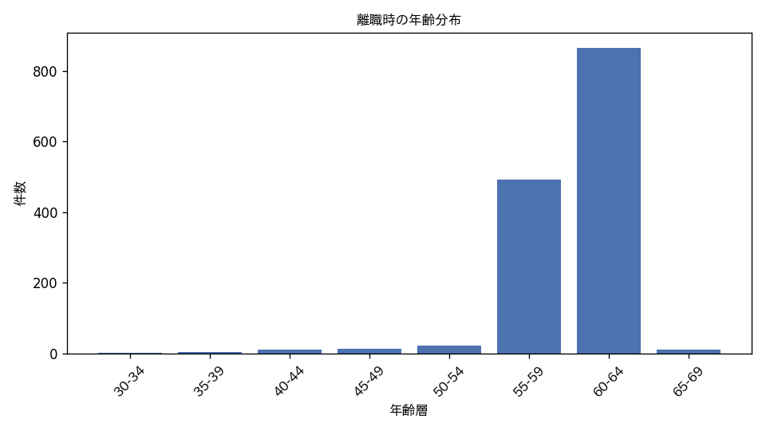
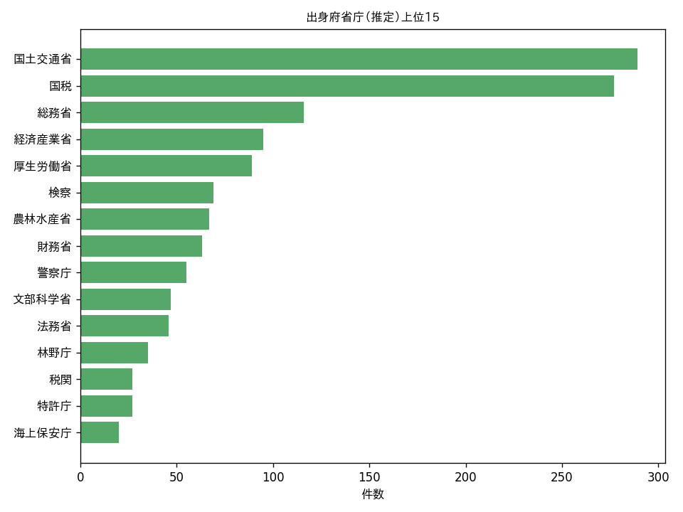
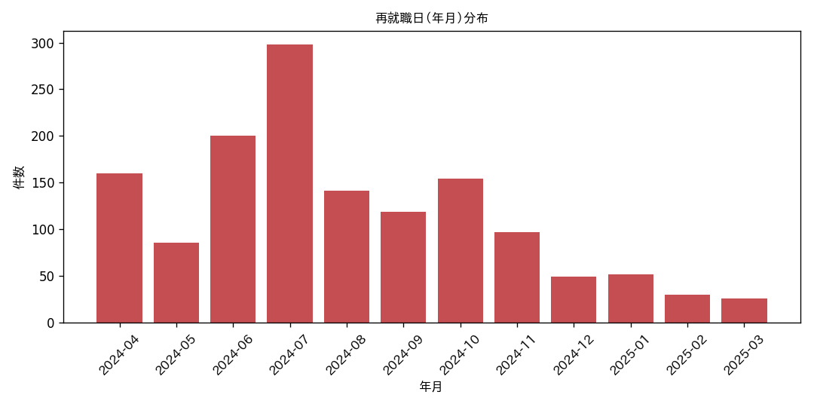

# 国家公務員 再就職状況の公表（令和6年度分）データ分析

対象期間: 令和6年4月1日〜令和7年3月31日 ／ 公表: 令和7年9月

様式: 公表様式（24-2）国家公務員法第106条の24第2項等の規定に基づく届出関連

## 概要

- 総レコード数: **1,422件**（1人が複数の再就職をしている場合は別行）
- 実人数（氏名ユニーク）: **1,187人**
- 求職の承認の有無: 無 1422
- 官民人材交流センターの援助の有無: 無 1370、有 42、有※ 10

## 離職時の年齢

平均 **59.1歳**（最小 33 / 最大 68）

| 年齢層 | 件数 |
|---|---|
| 30-34 | 2 |
| 35-39 | 4 |
| 40-44 | 11 |
| 45-49 | 14 |
| 50-54 | 22 |
| 55-59 | 493 |
| 60-64 | 866 |
| 65-69 | 10 |

## 出身府省庁（離職時の官職から推定）上位20

| 府省庁 | 件数 |
|---|---|
| 国土交通省 | 289 |
| 国税 | 277 |
| 総務省 | 116 |
| 経済産業省 | 95 |
| 厚生労働省 | 89 |
| 検察 | 69 |
| 農林水産省 | 67 |
| 財務省 | 63 |
| 警察庁 | 55 |
| 文部科学省 | 47 |
| 法務省 | 46 |
| 林野庁 | 35 |
| 税関 | 27 |
| 特許庁 | 27 |
| 海上保安庁 | 20 |
| 金融庁 | 17 |
| 内閣府 | 14 |
| 内閣官房 | 11 |
| 外務省 | 11 |
| 環境省 | 11 |

## 再就職先の名称 上位20

| 再就職先 | 件数 |
|---|---|
| 自営 | 12 |
| 自営業 | 10 |
| 一般財団法人港湾空港総合技術センター | 10 |
| 特許庁 | 9 |
| 三井住友信託銀行株式会社 | 6 |
| 関東地方更生保護委員会 | 6 |
| 辻・本郷税理士法人 | 6 |
| 一般財団法人日本森林林業振興会 | 6 |
| 一般社団法人日本民営鉄道協会 | 6 |
| 三井住友海上火災保険株式会社 | 5 |
| 富士通株式会社 | 5 |
| 公益財団法人安全衛生技術試験協会 | 5 |
| 一般財団法人日本建設情報総合センター | 5 |
| 内閣官房 | 4 |
| 損害保険ジャパン株式会社 | 4 |
| 西村あさひ法律事務所・外国法共同事業 | 4 |
| 一般財団法人東北電気保安協会 | 4 |
| 一般財団法人工業所有権協力センター | 4 |
| 一般社団法人寒地港湾空港技術研究センター | 4 |
| 鹿島建設株式会社 | 3 |

## 再就職先における地位 上位15

| 地位 | 件数 |
|---|---|
| 開業税理士 | 115 |
| 顧問 | 105 |
| 専務理事 | 77 |
| 公証人 | 37 |
| 常務理事 | 35 |
| 事務局長 | 35 |
| 参与 | 33 |
| 所属税理士 | 28 |
| - | 22 |
| 審議役 | 21 |
| 監査役 | 20 |
| 弁護士 | 18 |
| 理事長 | 17 |
| 理事 | 17 |
| 事務員 | 14 |

## 離職 → 再就職までの期間

平均 **177日** ／ 中央値 **92日** （最小 1 / 最大 730）

| 期間 | 件数 |
|---|---|
| 0-30日 | 135 |
| 31-90日 | 319 |
| 91-180日 | 530 |
| 181-365日 | 199 |
| 365日超 | 239 |

## 再就職日（年月）分布

| 年月 | 件数 |
|---|---|
| 2019-06 | 1 |
| 2020-07 | 1 |
| 2020-12 | 1 |
| 2021-05 | 2 |
| 2021-11 | 1 |
| 2022-06 | 1 |
| 2023-03 | 1 |
| 2023-07 | 1 |
| 2023-11 | 1 |
| 2024-04 | 160 |
| 2024-05 | 86 |
| 2024-06 | 200 |
| 2024-07 | 298 |
| 2024-08 | 141 |
| 2024-09 | 119 |
| 2024-10 | 154 |
| 2024-11 | 97 |
| 2024-12 | 49 |
| 2025-01 | 52 |
| 2025-02 | 30 |
| 2025-03 | 26 |

## 複数回再就職している人 上位10

| 氏名 | 件数 |
|---|---|
| 大村　慎一 | 7 |
| 田和　宏 | 5 |
| 茶谷　栄治 | 5 |
| 佐々木　博 | 4 |
| 大内　聡 | 4 |
| 小宮山　千代子 | 4 |
| 松尾　泰樹 | 4 |
| 大西　証史 | 4 |
| 及川　洋 | 4 |
| 保坂　伸 | 4 |

---
*本レポートは `analyze.py` により自動生成されました。*
